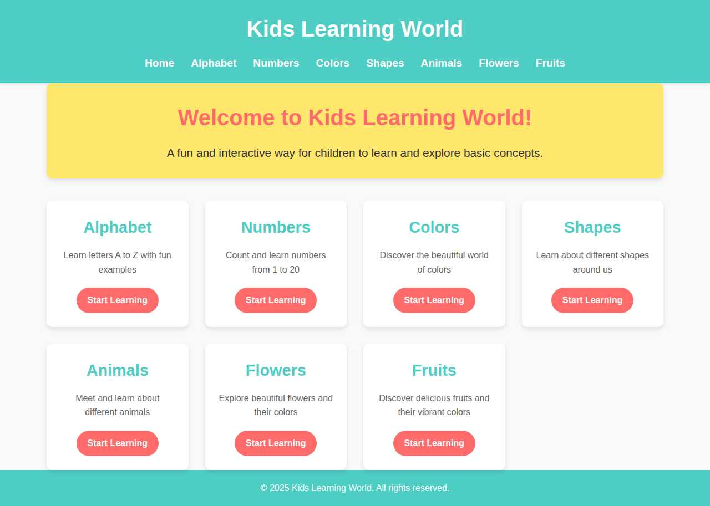

# Challenge 6 – Kids Learning App - Basic App Creation

> **Note:** You can use any programming language you're comfortable with for this challenge. Feel free to adapt the setup and implementation steps according to your chosen technology stack.


**Topics to be used:**

- **Topic 1: Plan:** Use Plan Mode to create a strategy before coding. Review and finalize a high-level plan, and start implementation only after approval.
- **Topic 2: Code:** Transition to Agent Mode. Once the plan is approved, implement the code according to the approved plan.
- **Topic 3: Test:** Test the application to ensure all features work as expected.
- **Topic 4: Generate Chat Instructions:** Create a rulebook of custom Copilot instructions to ensure consistency, enforce best practices and coding standards, and minimize AI hallucinations in future challenges.
- **Topic 5: Prompt Files:** Create targeted, reusable prompts for specific activities like code generation or conducting code reviews.
- **Topic 6: Custom Agents:** Documentation Specialist Agent – Responsible for creating and updating README files or other project documentation, ensuring consistent structure and formatting.


<a href="#">
    
</a>
## Overview
This challenge demonstrates building a simple web application using Node.js, Express, and EJS template engine. The app will be an educational platform for kids to learn various topics.

## Challenge: Kids Learning Platform

### Business Context
Create an interactive web application that helps children learn about:
- Alphabet letters
- Numbers (1-10)
- Colors
- Shapes
- Animals
- Nature (trees, birds)

### Technical Requirements

#### 1. Backend Setup
- **Framework**: Express.js (Node.js)
- **Template Engine**: EJS with layouts
- **Port**: 3000 (configurable via environment variable)
- **Structure**: MVC-like pattern

#### 2. Features to Implement

##### Phase 1: Basic Setup
- [x] Initialize Express application
- [x] Configure EJS as template engine
- [x] Set up static file serving
- [x] Create layout template for consistent design

##### Phase 2: Core Routes
- [x] Home page (`/`) - Landing page with navigation
- [x] Alphabet page (`/alphabet`) - Interactive alphabet learning
- [x] Numbers page (`/numbers`) - Number recognition
- [x] Colors page (`/colors`) - Color identification
- [x] Shapes page (`/shapes`) - Shape recognition
- [x] Animals page (`/animals`) - Learn about animals
- [x] Trees page (`/trees`) - Learn about different trees
- [x] Birds page (`/birds`) - Learn about various birds

##### Phase 3: Enhancements (To Do)
- [ ] Add audio pronunciations
- [ ] Create an admin panel for content management

#### 3. Current Implementation

**File Structure:**
```
kids-learning/
├── app.js                 # Main application file
├── package.json          # Dependencies and scripts
├── views/               # EJS templates
│   ├── layout.ejs       # Main layout template
│   ├── index.ejs        # Home page
│   ├── alphabet.ejs     # Alphabet learning page
│   ├── numbers.ejs      # Numbers learning page
│   ├── colors.ejs       # Colors page
│   ├── shapes.ejs       # Shapes page
│   ├── animals.ejs      # Animals page
│   ├── trees.ejs        # Trees page
│   └── birds.ejs        # Birds page
└── public/              # Static assets (CSS, JS, images)
```

**Key Dependencies:**
- `express`: Web framework
- `ejs`: Template engine
- `express-ejs-layouts`: Layout support for EJS

### How to Use This Challenge

#### 1. Development Setup
```bash
# Navigate to the project
cd kids-learning

# Install dependencies
npm install

# Run in development mode (with auto-reload)
npm run dev

# Or run in production mode
npm start
```

#### 2. Testing the Application
- Open browser and navigate to `http://localhost:3000`
- Click through different learning sections
- Verify all routes are working correctly


